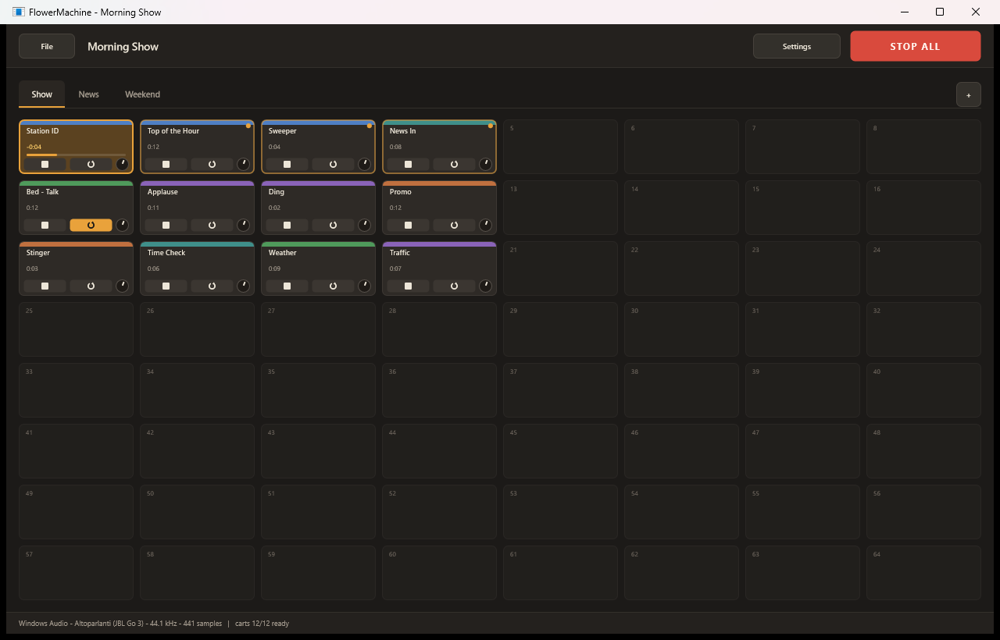
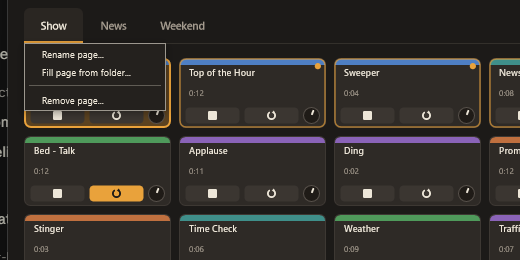
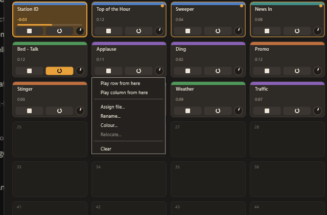

# FlowerMachine

A jingle machine: a grid of pads, each holding one sound, that plays the moment
you click it.



Sixty-four pads to a page, up to sixteen pages, switched with tabs.
Click a pad and it plays. Click it again and it starts over. Starting a pad
stops whatever else was playing, so one sound follows another cleanly — except
for a pad set to **Loop**, which keeps running underneath until you stop it
yourself or hit **STOP ALL**. A whole row or column can be played in order from
one right-click, for a run of stings or a bed of adverts.

Useful anywhere a sound has to land on cue and not a second later: a radio show,
a podcast, a theatre, a stream, a live set, a rehearsal room.

Windows 10 or later, 64-bit.

## Getting it

Download `FlowerMachineSetup.exe` from
[Releases](https://github.com/CardamomFlower/Flower/releases) and run it.

It installs for you alone, into `%LOCALAPPDATA%\Programs\FlowerMachine`, so it
never asks for an administrator password. Three tick-boxes, all on to start
with, offer a Start Menu entry, a desktop shortcut and the `.fmpreset` file
association. Uninstall it from Settings > Apps like anything else; your presets
are left where they are unless you tick the box that says otherwise.

## Filling it

Drag an audio file from Explorer onto any pad, or double-click an empty one to
browse. To load a whole page at once, right-click the page tab and pick **Fill
page from folder…**, which drops the folder's files into the empty pads in
name order.



The same menu renames a page, and the **+** at the right adds one.

## A pad

Each pad carries a title - the file name until you rename it - a **Stop**
button, a **Loop** toggle and a **Gain** knob running from −24 to +18 dB, which
a double-click puts back to zero. While it plays it shows the time remaining
and a progress bar. The colour band along the top is yours to use however you
like: by kind, by segment, by whoever is on next.

Right-click a pad for the rest. The same menu plays a whole **row** or
**column** in sequence, starting from that pad and stopping at the edge of the
grid. Each sound starts a short moment after the one before it ends — the queue
is watched thirty times a second, so it is a quick hand-over and not a butt
join; if two sounds have to run together, put the join inside one file. The
pads still to come are outlined and carry a dot, so you can see what is queued
before it goes out.

The queue is settled the moment you start it: empty pads, missing pads and pads
that failed to load are left out, and one you clear or point somewhere else
while it waits is passed over rather than waited for. Deleting the audio file
itself mid-run changes nothing — a loaded pad plays from memory. **Loop** is ignored
inside a sequence, so a looping pad plays once and hands on — the toggle itself
is untouched, and clicking that pad on its own still loops. A bed you started
by hand before the sequence keeps running underneath it.

The run ends when you press Stop on the pad that is sounding, press **STOP
ALL**, click a loaded pad by hand, change page, or open another preset. A click
on an empty or missing pad starts nothing and so ends nothing. Pressing
Stop on a pad that is only waiting its turn drops that one from the queue and
leaves the rest running. Only one sequence runs at a time.



## Presets

`File > Save` writes a `.fmpreset` file: your pages, your pads, their titles,
colours, gains and loop flags. The audio itself is never copied; a preset
points at your own library.

Each pad remembers both where its file is and where it sits relative to the
preset, so moving a preset together with its audio folder keeps everything
working - useful when the machine you prepare on and the machine you play from
are not the same. If a file has genuinely gone, the pad is marked **missing**
and keeps its name so you can see what is absent; **Relocate…** points it at
the file again. Missing files never stop a preset from opening; only a file
that is damaged or not a preset at all is refused.

Double-clicking a `.fmpreset` in Explorer opens it, whether FlowerMachine is
running or not; only one copy runs at a time, so the file goes to the window
you already have.

Only the page you are looking at is held in memory, so a set with many pages
does not fill the machine. A pad already playing carries on to the end.

## Sound

Stereo output through WASAPI - shared, low-latency or exclusive - or
DirectSound. No ASIO. It plays WAV, AIFF, FLAC, OGG Vorbis, MP3 and WMA. AAC,
M4A and Opus are not supported; convert those first. A file longer than thirty
minutes is refused, and only the first two channels of a file are used.

Files are decoded to memory when a page opens, so a click reaches the output
immediately rather than waiting on the disk.

**Settings** picks the output device and has a test tone for checking the
routing before you start. It also holds **Colours** — dark or light, switched
without restarting and remembered — and a **Renderer** switch: if the window will not draw
properly on an older graphics driver, change it from Direct2D to Software. If
it will not draw at all, start the program once as
`FlowerMachine.exe --software-renderer`, which forces Software for that run;
set the switch there and it holds from the next start on.

## Building from source

You need JUCE 8.0.12 and Visual Studio 2022. There is no CMake build — the
Visual Studio project is generated by the Projucer.

The `.jucer` files expect JUCE at `C:\Program Files\JUCE`. If yours lives
somewhere else, open them in the Projucer and repoint the module paths before
saving.

```
"C:\Program Files\JUCE\Projucer.exe" --resave FlowerMachine.jucer
"C:\Program Files\Microsoft Visual Studio\2022\Community\MSBuild\Current\Bin\MSBuild.exe" Builds\VisualStudio2022\FlowerMachine.sln /p:Configuration=Release /p:Platform=x64 /m
```

`FlowerMachine.exe` lands in `Builds\VisualStudio2022\x64\Release\App\`. Both
configurations link the C runtime statically, so it is a single file that needs
no redistributable, and it uses nothing beyond JUCE itself.

The installer is a second, separate program that carries a copy of
`FlowerMachine.exe` inside it. Build the app first, then:

```
python Installer\pack-payload.py
"C:\Program Files\JUCE\Projucer.exe" --resave Installer\FlowerMachineSetup.jucer
"C:\Program Files\Microsoft Visual Studio\2022\Community\MSBuild\Current\Bin\MSBuild.exe" Installer\Builds\VisualStudio2022\FlowerMachineSetup.sln /p:Configuration=Release /p:Platform=x64 /m
```

`pack-payload.py` wraps the freshly built `FlowerMachine.exe` in a small header
and puts it where the resource compiler will find it. Run it again whenever the
app changes.

## Licence

[GNU Affero General Public License v3.0](LICENSE).

JUCE 8 is offered either under the AGPLv3 or under a paid commercial licence.
This project takes the first road, which means anything you build and
distribute from this source has to carry the same licence and come with its
source.
