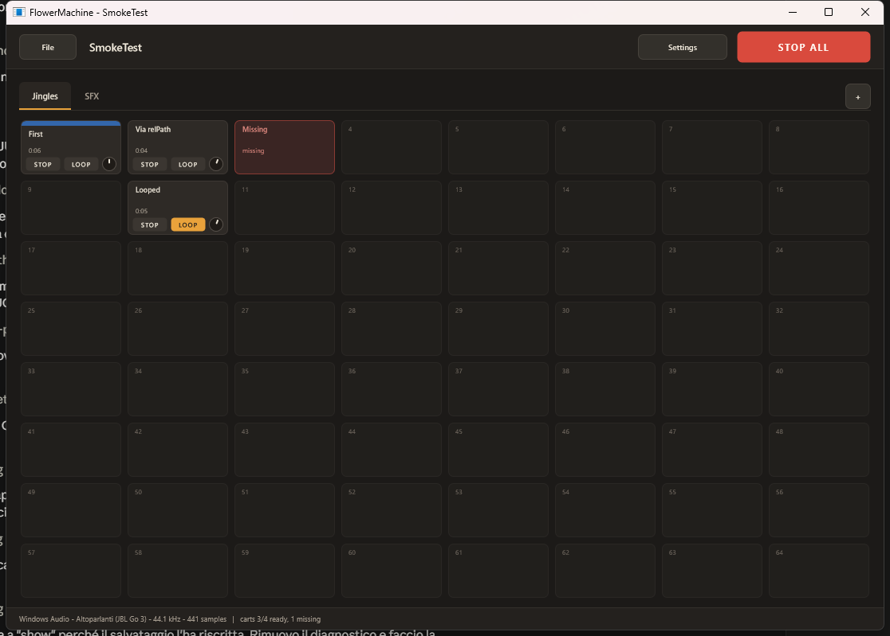

# FlowerMachine

A cart wall for radio use: an 8x8 grid of carts, pages as tabs, presets saved to
file. Click a cart to play it, click again to restart it. Starting a cart stops
whatever else is playing, unless that cart is looping — a bed keeps running under
the jingles until its own Stop, or STOP ALL.

Windows desktop application, mouse only. Part of
[Cardamom Tools](https://www.cardamomflower.dev).



## A cart

A title, taken from the file name unless you rename it. A **Stop** button, a
**Loop** toggle, and a **Gain** knob from −24 to +18 dB (double-click resets it).
While a cart plays it shows the time remaining and a progress bar. An optional
colour band groups carts by kind.

Assign a file by dropping it on a cell from Explorer, by double-clicking an empty
cell, or from the cart's right-click menu. The page tab's right-click menu can
fill a whole page from a folder in one go.

## Presets

A preset is the set of pages with their cart assignments, saved as `.fmpreset`
XML in `Documents\FlowerMachine\Presets` by default. Each cart records both an
absolute path and a path relative to the preset file, so a preset moved together
with its audio library keeps working. A file that resolves nowhere leaves the
cart marked *missing*, with its title and colour intact and a **Relocate…**
command to repair it — the preset always opens.

Only the visible page is held in memory. Switching tab unloads the page you left
and decodes the one you opened; a cart already playing carries on to the end.

## Audio

Output only, stereo, through WASAPI (shared or exclusive) or DirectSound. WAV,
AIFF, FLAC, OGG Vorbis and MP3 are decoded by JUCE; AAC, M4A and WMA go through
Windows Media Foundation. Opus is not supported — convert those files first.

Everything is decoded to RAM at the device sample rate, so a click reaches the
output within one audio block. Settings has a test tone for checking the routing
before a show, and a **Renderer** switch (Direct2D or software) for machines
whose graphics driver cannot manage Direct2D; `FlowerMachine.exe
--software-renderer` forces the fallback for one run if the window will not paint
at all.

## Building

JUCE 8.0.12 and Visual Studio 2022, x64. There is no CMake build: the project is
generated by the Projucer.

```
"C:\Program Files\JUCE\Projucer.exe" --resave FlowerMachine.jucer
MSBuild Builds\VisualStudio2022\FlowerMachine.sln /p:Configuration=Release /p:Platform=x64 /m
```

The executable lands in `Builds\VisualStudio2022\x64\Release\App\`. Both
configurations link the runtime statically, so the result is a single file with
no redistributable to install. Zero third-party dependencies.

## Layout

| Path | What |
|---|---|
| `Source/Model/` | the preset document: ValueTree, XML, path resolution |
| `Source/Engine/` | the audio thread: voices, mixing, lock-free sample handoff |
| `Source/Loading/` | decoding and resampling on a thread pool |
| `Source/Control/` | the one place model, loader and engine meet |
| `Source/UI/` | everything that knows about pixels |
| `docs/ARCHITECTURE.md` | the design, locked; decisions and their reasons |
| `docs/REVIEW-2026-09-04.md` | code review findings and what was done about them |
| `design/` | the design canvas artboards |
